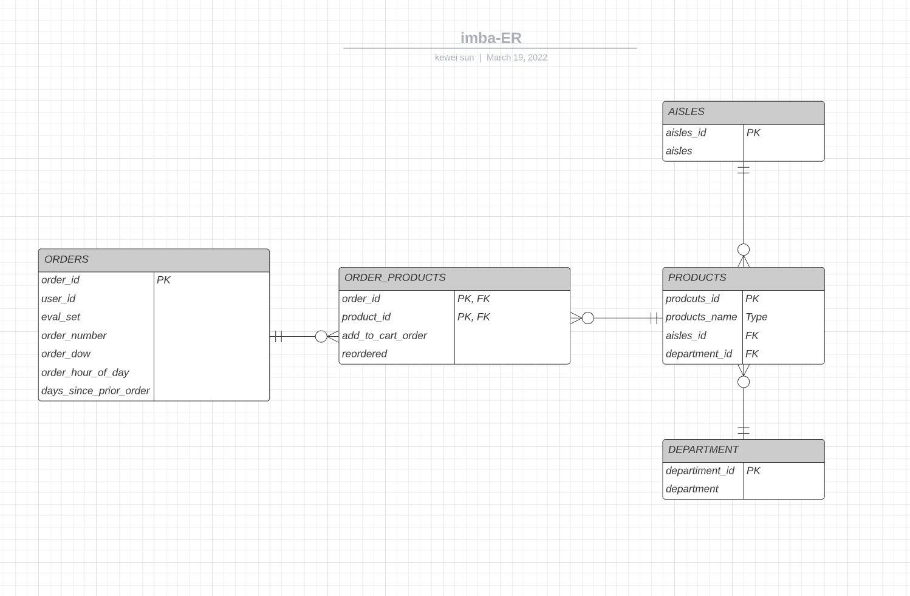

# 1. IMBA ERD Design

This ERD example model a simple order system with the following entities:

* Aisles: stores aisles’s data.
* Departments: stores a list of products departments categories.
* Products: stores a list of products.
* Orders: stores sales orders placed by customers.
* OrdersProduct: stores order line items for each order.



## Order_products Table and Products Table

Order_products --> Products
* An order could included one or multiple products, for each product under a order, it can only one kind of product, so the relationship from Order_products table to Products table is **One and limit One**.

Products --> Order_products
* A product could be a part of **no orders**, but it also could be a product of many orders, so the relationship from products to order is **Zero to Many**.

## Products and Aisles Table

Products --> Aisles
* A product can only include one aisle, so the relationship from products to aisles is **One to One**.

Aisles --> Products
* An aisle could include zero or multiple products, so the relationship from aisles to products is **Zero to Many**.


## Products and Departments Table 

Products --> Departments
* A product can only include one department, so the relationship from products to departments is **One to One**.

Departments --> Products
* A department could include zero or multiple products, so the relationship from departments to products is **Zero to Many**.


## Order_products and Orders Table

Order_products --> Orders
* An order can have multiple products; each product will be shown in a separate line in the Order_products table. So there can be one or more order lines for a single order, so the relationship from Order_products to Orders table is **One to One**.

Orders --> Order_products
* For each order, there will be zero or more order lines in Order_products table. However, if an order gets cancelled (destroyed) or any other specific reason, then order lines could not exist in the Order Products table. So the relationship from Orders to Order_products is **Zero to Many**.


# 2. SQL Query from IMBA Data Set

Design a query to join orders table and order_products table together, filter on eval_set = ‘prior’

```sql
select * 
from prod.orders o left join prod.order_products op 
    on o.order_id = op.order_id
where eval_set = 'prior'
limit 20;
```
