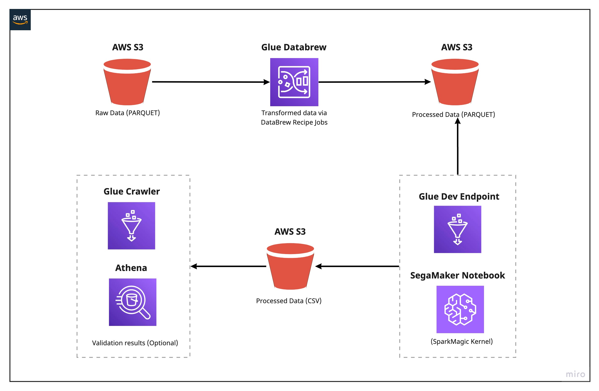
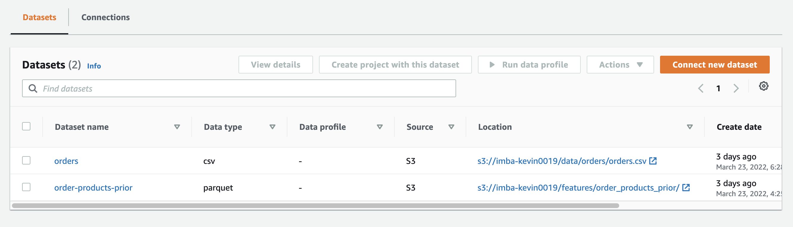
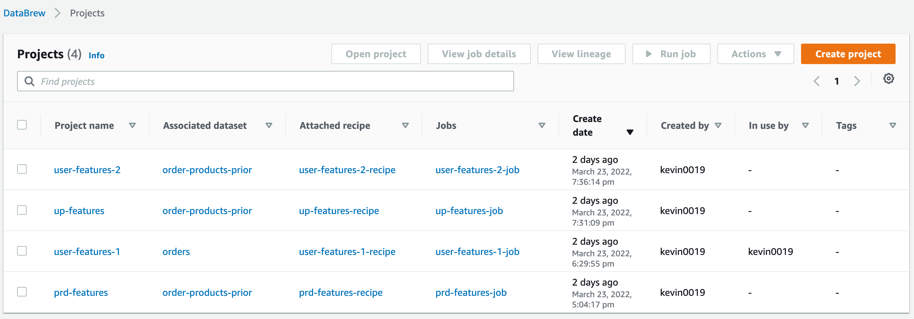
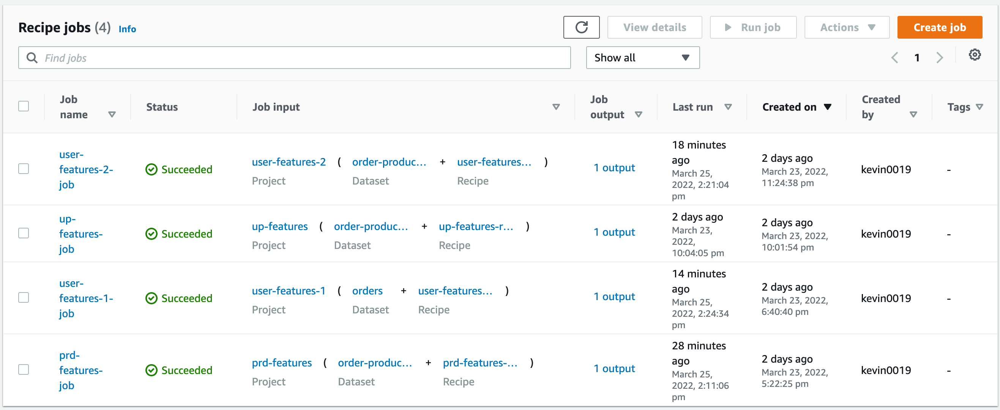
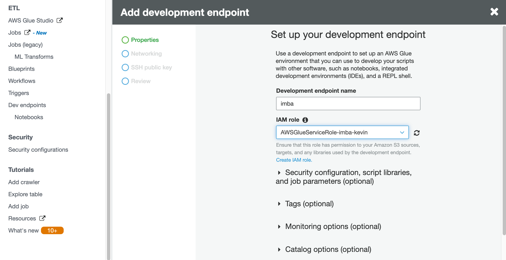

# **Project part 3**

## Work flow
Business Requirement:

Factors that effect user behaviour to be created (Assume from DS team)
1. user (user_feature_1, user_feature_2)
2. product (prd_features)
3. preference = user + product (up_features)

High levels in Solution:


## AWS Glue DataBrew 
Data Preporcessing by Glue DataBrew. AWS Glue DataBrew is a visual data preparation tool that enables users to clean and normalize data without writing any code. DataBrew is serverless, can explore and transform terabytes of raw data without needing to create clusters or manage any infrastructure.

## 1. Create dataset


## 2. Create Projects with recipe (step function)


## 3. Create jobs to load in S3 


## 4. Create development endpoint to open notebook


## AWS glue development endpoint (output in [join-features.ipynb](./join-features.ipynb))
```python

import sys
from awsglue.transforms import *
from awsglue.utils import getResolvedOptions
from pyspark.context import SparkContext
from awsglue.context import GlueContext
from awsglue.job import Job

glueContext = GlueContext(SparkContext.getOrCreate())

prd_feature = glueContext.create_dynamic_frame_from_options(connection_type = "parquet", connection_options = {"path": ["s3://imba-kevin0019/features/prd_feature_db/"]})
prd_feature.printSchema()
print("Count: ", prd_feature.count())


up_features = glueContext.create_dynamic_frame_from_options(connection_type = "parquet", connection_options = {"path": ["s3://imba-kevin0019/features/up_feature_db"]})
up_features.printSchema()
print("Count: ", up_features.count())


user_features_1 = glueContext.create_dynamic_frame_from_options(connection_type = "parquet", connection_options = {"path": ["s3://imba-kevin0019/features/user_feature_1_db/"]})
user_features_1.printSchema()
print("Count: ", user_features_1.count())


user_features_2 = glueContext.create_dynamic_frame_from_options(connection_type = "parquet", connection_options = {"path": ["s3://imba-kevin0019/features/user_feature_2_db/"]})
user_features_2.printSchema()
print("Count: ", user_features_2.count())

Count:  206209

# join user features together
users = Join.apply(user_features_1.rename_field('user_id','user_id1'), user_features_2, 'user_id1', 'user_id').drop_fields(['user_id1'])


# join everything together
df = Join.apply(Join.apply(up_features, 
                  users.rename_field('user_id','user_id1'), 
                  'user_id','user_id1').drop_fields(['user_id1']),
      prd_feature.rename_field('product_id','product_id1'), 
      'product_id','product_id1').drop_fields(['product_id1'])
      
      
      
# convert glue dynamic dataframe to spark dataframe
df_spark = df.toDF()
df_spark.repartition(1).write.mode('overwrite').format('csv').save("s3://imba-kevin0019/features/features_join", header = 'true')


```
