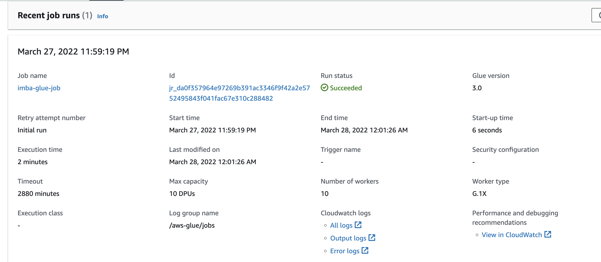

# **Project part 4**

## AWS Glue jobs (3.0)

### high-level description:

- Create the Glue job with Spark script editor

- Read the source table (parquet) from S3

- Join the source table and converted

- Write joined table as csv back to S3

## Job detials

- Name: imba-glue-job
- IAM Role: AdministratorAccess
- Tpye: Spark
- Glue version: Glue 3.0 - Supports spark 3.1, Scala 2, Python 3
- Language: Python 3




## Script

```python

from pyspark.context import SparkContext
from awsglue.context import GlueContext

sc = SparkContext()
glueContext = GlueContext(sc)
spark = glueContext.spark_session


prd_feature = spark.read.parquet("s3://imba-kevin0019/features/prd_feature_db/")
up_features = spark.read.parquet("s3://imba-kevin0019/features/up_feature_db")
user_features_1 = spark.read.parquet("s3://imba-kevin0019/features/user_feature_1_db")
user_features_2 = spark.read.parquet("s3://imba-kevin0019/features/user_feature_2_db")

# join everything together
joinDF = ((up_features.join(prd_feature, "product_id")).join(user_features_1, "user_id")).join(user_features_2, "user_id")

singleDF = joinDF.repartition(1)
singleDF.write.csv("s3://imba-kevin0019/features/features_join", header = "true")

```
