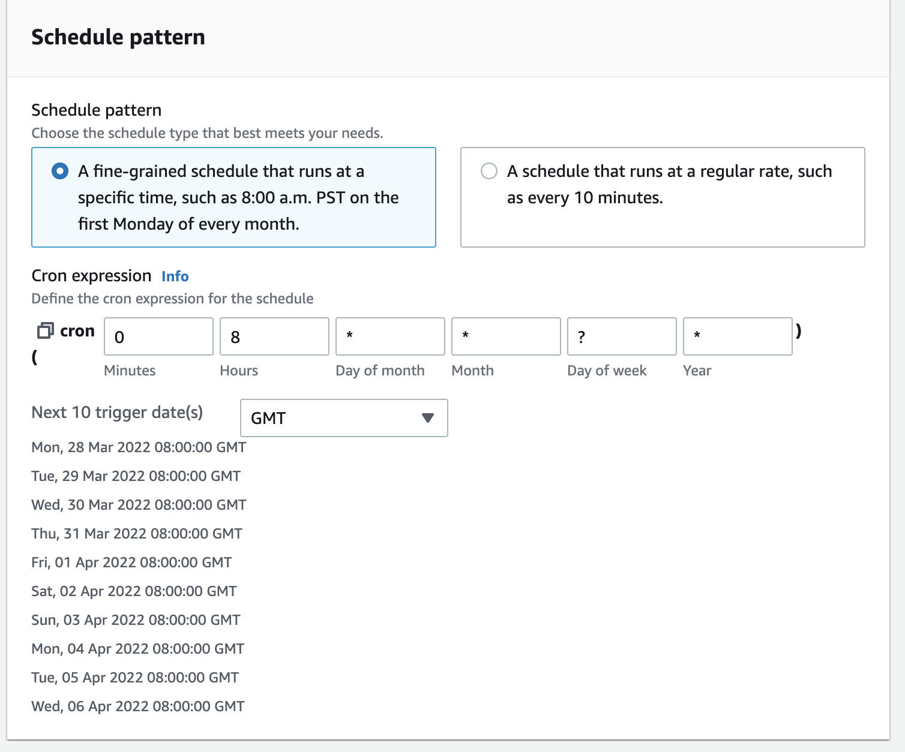
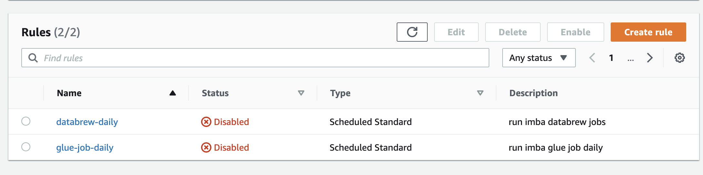
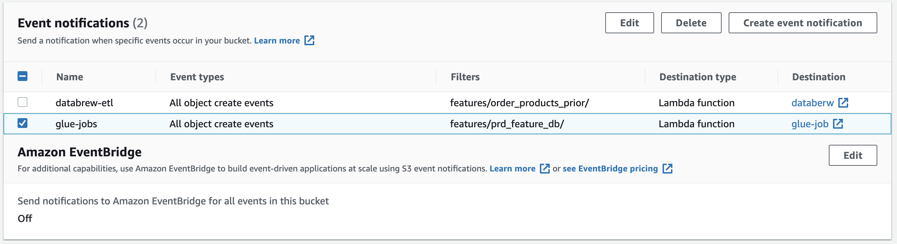

# **Project part 5**

For both schedule based and trigger based we need same Lambda funcitons to trigger Databrew jobs and Glue jobs, but the trigger for lambda is different. One is base on S3 upload event notification, the other is scheduled on Eventbidge.

## Lambda function for Databrew

- name: databrew
- runtime: python 3.8
- IAM role: full access to Databrew
- Timeout: 15 sec


```python
import boto3
databrew= boto3.client('databrew')
def lambda_handler(event, context):    
    response = databrew.start_job_run(Name='prd-features-job')
    response = databrew.start_job_run(Name='user-features-2-job')
    response = databrew.start_job_run(Name='up-features-job')
    response = databrew.start_job_run(Name='user-features-1-job')
    
```

## Lambda function for Glue job

- name: glue-job
- runtime: python 3.8
- IAM role: full access to Glue
- Timeout: 10 sec


```python
import boto3
glue= boto3.client('glue')
def lambda_handler(event, context):    
    response = glue.start_job_run(JobName='imba-glue-job')
```


# Schedule Based ETL Pipline

.jpeg)

After bulid two Lambda funtion we can create EventBridge to trigger it.

## Rule for trigger Databrew:

- name: databrew-etl-daily
- Rule type: schedule
- pattern: fine-grained schedule (Cron)
- target: lambda functon (databrew)

## Rule for trigger Glue Job:

- name: glue-job-etl-daily
- Rule type: schedule
- pattern: fine-grained schedule (Cron)
- target: lambda functon (glue-job)




### We use trigger based for now



# Trigger Based ETL Pipline

.jpeg)

### Base on the Lambda function, we create event notification




