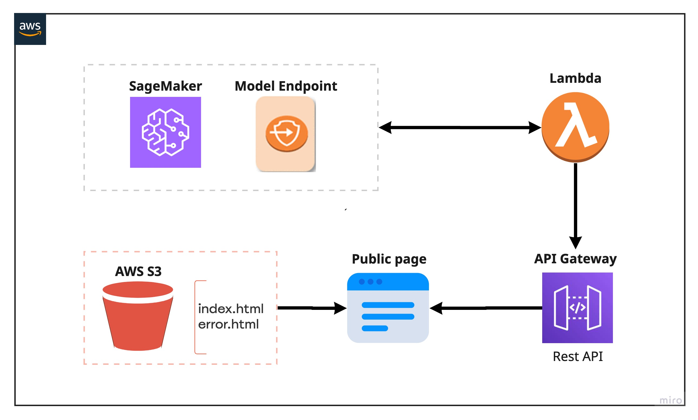
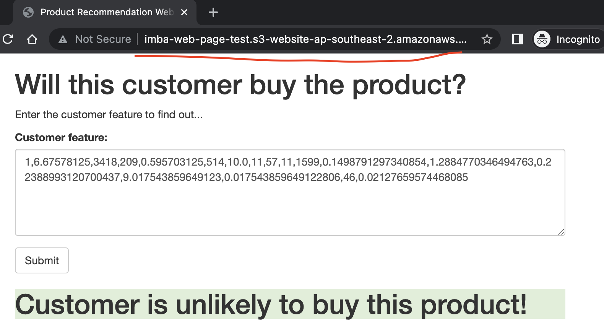

# **Project part 6**

There are two steps for this part. First, we need to build out a model, typically this is a data scientist's job, and they will fit the model locally to find the best parameter. Then we can use the parameter to deploy the best model on the cloud, that consumers can easily invoke and get predictions from our model.


# 1. Build XGBoost model in R 

## Why XGBoost?

- There is a nomalization term in the cost function, it can prevent overfiting.
- Multi-thread processing
- For missing features in the data, XGBoost can automatically study its seperate direction
- Build-in cross validation (xgb.cv())

### Disadvantages

- Too many parameters need to tune
- Can only fit stuctured data 
- Not perform well on high dimentions data (many features)  


-----------
- model code in [main.R](./model/r/main.R)
- configrations in [global.dcf](./model/r/global.dcf)

## Add new features for training

```
data$prod_reorder_probability <- data$prod_second_orders / data$prod_first_orders
data$prod_reorder_times <- 1 + data$prod_reorders / data$prod_first_orders
data$prod_reorder_ratio <- data$prod_reorders / data$prod_orders
data$user_average_basket <- data$user_total_products / data$user_orders
data$up_order_rate <- data$up_orders / data$user_orders
data$up_orders_since_last_order <- data$user_orders - data$up_last_orders
data$up_order_rate_since_first_order <- data$up_orders / (data$user_orders - data$up_first_orders + 1)
```

## Set hyper parameter grid

```
hyper_grid <-expand.grid(
  nrounds =               c(3000),
  objective =             c("binary:logistic"),
  eval_metric =           c("auc"),
  max_depth =             c(6),
  eta =                   c(0.1,0.05),
  gamma =                 c(0.7,0.5),
  colsample_bytree =      c(0.95),
  subsample =             c(0.75),
  min_child_weight =      c(10),
  alpha =                 c(2e-05),
  lambda =                c(10),
  scale_pos_weight =      c(1)
)
```

## Use cross validation to find the best parameter


```
for(i in 1:nrow(hyper_grid)){
  cat(paste0("\nModel ", i, " of ", nrow(hyper_grid), "\n"))
  cat("Hyper-parameters:\n")
  print(hyper_grid[i,])
  
  metricsValidComb <- data.frame()
  
  
  cv.nround = 100
  cv.nfold = 3
  mdcv <- xgb.cv(data=train_data, params = as.list(hyper_grid[i,]), nthread=6, 
                 nfold=cv.nfold, nrounds=cv.nround,
                 verbose = T)
  
  model_auc = min(mdcv$evaluation_log$test_auc_mean)
  
  # make prediction on the validation dataset
  #evaluation <- predict(model, newdata = valid_data_x)
  # calculate AUC based on the prediction result
  #metrics <- roc(as.vector(valid_data_y), evaluation)
  # get the auc value
  #model_auc <- as.numeric(metrics$auc)
  # put together AUC and the best iteration value
  metrics_frame <- data.frame(AUC = model_auc)
  # combine the result for each fold
  #metricsValidComb <- rbind(metricsValidComb, metrics_frame)
  final_valid_metrics <- rbind(final_valid_metrics, metrics_frame)
  cat(paste0("AUC: ", round(model_auc, 3), "\n"))
  
}
```


For model in python see [IMDB-model-build.ipynb](./model/python/IMDB-model-build.ipynb)


# 2. Deploy the model on Segemaker

AWS SageMaker lets us host our model and packaging as an endpoint that consumers can invoke by a secure and simple API call using an HTTPS request.

High level solutions in this part:

- Train the model in Segamaker notebook instance
- Deploy the model as an end-points
- Invoking the endpoint from the web
    - Building Lambda Function
    - Building API Gateaway (Rest API)
    - Invoke API Gateway with Lambda
- Test App




For model deployment see [IMDB-model-deployment.ipynb](./model/python/IMDB-model-deployment.ipynb)


## Creating the endpoint and test the model on Segamaker

Deploying the model to SageMaker hosting just requires a deploy call on the fitted model. This call takes an instance count, instance type. These are used when the resulting predictor is creatd on the endpoint.

Pay attention to the instance type ml.m4.xlarge in below script where the model is being deployed, Amazon SageMaker doesn’t support automatic scaling for burstable instances such as t2. We would normally use the t2 instance types as part of development and light testing.


```
# Import api
import boto3
runtime = boto3.Session().client('sagemaker-runtime')

# Deploy the pre-trained model 'xgb_attached' as an endpoint
xgb_predictor = xgb_attached.deploy(initial_instance_count = 1, instance_type = 'ml.m4.xlarge')

# get the endpoint name and take note
xgb_predictor.endpoint

# invoke the endpoint 'xgb_predictor.endpoint' AND interact with endpoint
response = runtime.invoke_endpoint(EndpointName = xgb_predictor.endpoint, 
                                                  ContentType = 'text/csv',
                                                  Body = '1,6.67578125,3418,209,0.595703125,514,10.0,11,57,11,1599,0.1498791297340854,1.2884770346494763,0.22388993120700437,9.017543859649123,0.017543859649122806,46,0.02127659574468085') # test script: featureing fields in the model

# response: the probablility of a user buy the product
response['Body'].read().decode('utf-8')
```


## Build lambda function [model-endpoint.py](./model/model-endpoint.py)


- Name: imba-xgb-func
- IAM Role: full access to Sagemaker
- Timeout: 20s

```
# We need to use the low-level library to interact with SageMaker since the SageMaker API
# is not available natively through Lambda.
import boto3

def lambda_handler(event, context):

    body = event['body']

    # The SageMaker runtime is what allows us to invoke the endpoint that we've created.
    runtime = boto3.Session().client('sagemaker-runtime')

    # Now we use the SageMaker runtime to invoke our endpoint, sending the review we were given
    response = runtime.invoke_endpoint(EndpointName = 'xgboost-2022-04-04-06-41-40-259',# The name of the endpoint we created
                                       ContentType = 'text/csv',                 # The data format that is expected
                                       Body = body
                                       )

    # The response is an HTTP response whose body contains the result of our inference
    result = response['Body'].read().decode('utf-8')

    # Round the result so that our web app only gets '1' or '0' as a response.
    result = float(result)

    return {
        'statusCode' : 200,
        'headers' : { 'Content-Type' : 'text/plain', 'Access-Control-Allow-Origin' : '*' },
        'body' : str(result)
    }
```

# 3. Setting up API Gateway and hosting website

AWS has updated the API Gateway, the URL in API Gateway Console is no longer can be used, we should add a triggers and invoke with the API (Security: open) in the Lambda function.

** API Gateway Console **

After the stack has been created successfully, you can make a test call at API Gateway console

- Action: Create Method -- POST
- Integration type: Lambda Function (imba_xgboost)
- Deploy API

** Setting up API Gateway in the website (Rest API) **

Replace the ACTION URL in [index_imba.html](./index_imba.html) with the API URL


```
<form method="POST"
      action="https://2wt5nngbma.execute-api.ap-southeast-2.amazonaws.com/prod/imba-xgb-func"
      onsubmit="return submitForm(this);" >                     <!-- HERE IS WHERE YOU NEED TO ENTER THE API URL -->
    <div class="form-group">
        <label for="review">Customer feature:</label>
        <textarea class="form-control"  rows="5" id="review">Please put feature here.</textarea>
    </div>
    <button type="submit" class="btn btn-default">Submit</button>
</form>
```

# 4. Hosting a Static Websites on AWS S3 and Testing

Create a new S3 bucket:

- Name: imba-web-page-test
- Untick Block all public access
- upload [index_imba.html](./index_imba.html) file to S3 bucket
- upload error.html to S3 bucket
- Enabling static website hosting under Properties tab
- Editing Bucket Policy under Permission tab for public access.

You can test the endpoint by copy the test case to the block:

'1,6.67578125,3418,209,0.595703125,514,10.0,11,57,11,1599,0.1498791297340854,1.2884770346494763,0.22388993120700437,9.017543859649123,0.017543859649122806,46,0.02127659574468085'




